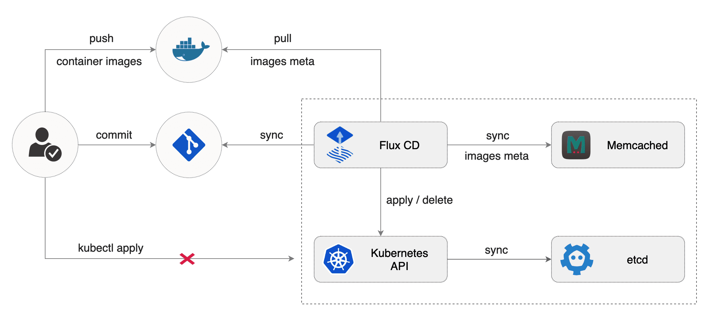

# GitOps using Flux: How we manage Kubernetes clusters at Staffbase

Repository for my talk at the **Kubernetes and Cloud Native Meetup Dresden** about GitOps using Flux on the 30. January 2020.

- Presentation: [GitOps using Flux: How we manage Kubernetes clusters at Staffbase](./assets/gitops-using-flux.pdf)
- Twitter: [@rico_berger](https://twitter.com/rico_berger)

## What is GitOps?

*"GitOps is a way to do Kubernetes cluster management and application delivery. It works by using Git as a single source of truth for declarative infrastructure and applications. With Git at the center of your delivery pipelines, developers can make pull requests to accelerate and simplify application deployments and operations tasks to Kubernetes."*

## Flux: The GitOps Kubernetes Operator

- Ensures that the state of a cluster matches the config in Git
- Uses an operator in the cluster
- Monitors image repositories, detects new images, triggers deployments



- No separate CD tool
- No access to the cluster for CI tools
- Every change is atomic and transactional
- Git has the audit log

## Demo

### Preparation

Create two clusters, one for the productive environment and one for development:

```sh
kind create cluster --name dev
kind create cluster --name prod
```

Configure your terminal to access the clusters:

```sh
export KUBECONFIG="$(kind get kubeconfig-path --name="dev")"
export KUBECONFIG="$(kind get kubeconfig-path --name="prod")"
```

Install Flux:

```sh
kubectl create namespace flux

helm repo add fluxcd https://charts.fluxcd.io

helm upgrade --namespace flux --install flux -f k8s/flux-dev.yaml fluxcd/flux --version 1.1.0
helm upgrade --namespace flux --install flux -f k8s/flux-prod.yaml fluxcd/flux --version 1.1.0
```

Give Flux write access to your repository. Run the following command to get SSH public key:

```sh
fluxctl identity --k8s-fwd-ns flux
```

Add the key to your repository [https://github.com/ricoberger/gitops-using-flux/settings/keys/new](https://github.com/ricoberger/gitops-using-flux/settings/keys/new)

When you added the key to your repository, you can wait until Flux syncs the state in your repository with your cluster or you can start the sync process with the following command:

```sh
fluxctl sync --k8s-fwd-ns flux
```

### Structure

The state of the `dev` and `prod` cluster is defined in the `k8s` folder. The folder is structured as follows:

```
k8s                            # The k8s is used by Flux for the state of the clusters
├── dev                        # State for the dev cluster
│   ├── flux-patch.yaml        # Flux patches for the dev cluster
│   ├── kustomization.yaml     # Kustomize file for the dev cluster
│   └── server                 # Dev specific settings for the server deployment
├── prod                       # State for the dev cluster
│   ├── flux-patch.yaml        # Flux patches for the prod cluster
│   ├── kustomization.yaml     # Kustomize file for the prod cluster
│   └── server                 # Prod specific settings for the server deployment
└── shared                     # Shared files between the dev and prod cluster
    ├── flux                   # Deployment for the Flux Helm Operator
    ├── kustomization.yaml     # Kustomize file for the prod cluster
    ├── prometheus             # Deployment for the Prometheus Operator Helm Chart
    └── server                 # Deployment for the server
```

#### Server Deployment

The template for the server deployment is defined in the `k8s/shared/server/server-deploy.yaml` file. This template is customized for the dev and prod cluster in the `k8s/dev/server/server-deploy` and `k8s/prod/server/server-deploy` files.

```yaml
---
# apiVersion, kind, metadata.name and metadata.namespace
# are required in the patch file the merge with the base file
apiVersion: apps/v1
kind: Deployment
metadata:
  name: server
  namespace: server
  annotations:
    # Enable the automation feature of Flux
    fluxcd.io/automated: "true"
    # Deploy every new image where the tag matches
    # - 'master-*' for dev
    # - 'regexp:^(0|[1-9]\d*)\.(0|[1-9]\d*)\.(0|[1-9]\d*)$' for prod
    # We are using 'regexp' instead of 'semver' because there is a "bug" where semver also matches images with the tag '1337'
    fluxcd.io/tag.server: "glob:master-*"
spec:
  # For the dev cluster we want to create 3 replicas and for the prod cluster 5 replicas
  replicas: 3
  template:
    spec:
      containers:
        - name: server
          # Flux will not update the image here, instead the currently used image will be saved in the 'flux-patch.yaml' files
          image: ricoberger/gitops-using-flux:master-03206b7
          # Use different log levels for the dev and prod environment
          args:
            - --log.level=info
          # Set different resources for the dev and prod environment
          resources:
            limits:
              cpu: 100m
              memory: 128Mi
            requests:
              cpu: 50m
              memory: 64Mi
```

#### Prometheus Operator Helm Chart

With the Flux Helm Operator you can also deploy Helm charts. An example can be found in the `k8s/shared/prometheus/prometheus-operator-helm.yaml` file.

```yaml
---
# Custom Resource for the Flux Helm Operator
apiVersion: helm.fluxcd.io/v1
kind: HelmRelease
metadata:
  name: prometheus-operator
  namespace: monitoring
spec:
  # Release name of the Helm chart
  releaseName: prometheus-operator
  chart:
    # Helm repository, the name and version of the Helm chart
    repository: https://kubernetes-charts.storage.googleapis.com/
    name: prometheus-operator
    version: 8.5.14
  # Values for the Helm chart
  values:
    defaultRules:
      create: false

    coreDns:
      enabled: false

    kubeDns:
      enabled: false

    kubeControllerManager:
      enabled: false

    kubeScheduler:
      enabled: false

    kubeProxy:
      enabled: false

    nodeExporter:
      enabled: false

    alertmanager:
      enabled: false

    prometheus:
      prometheusSpec:
        image:
          tag: v2.15.2
        enableAdminAPI: true
        retention: 1d
        replicas: 1

    grafana:
      enabled: false
```
